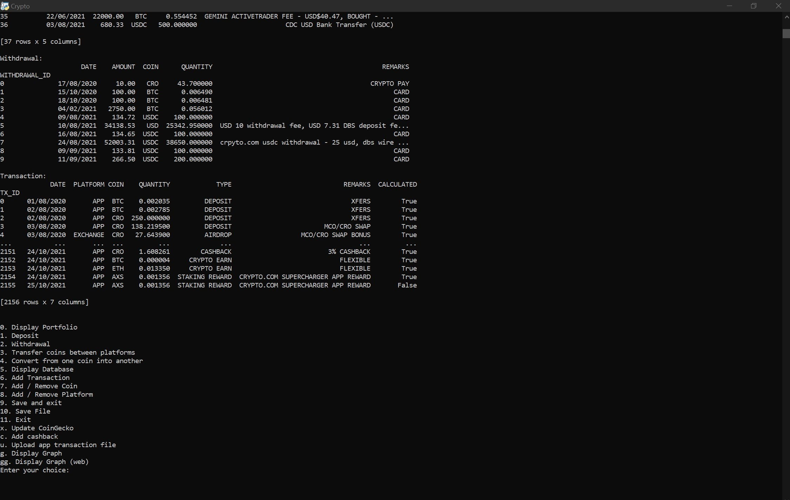
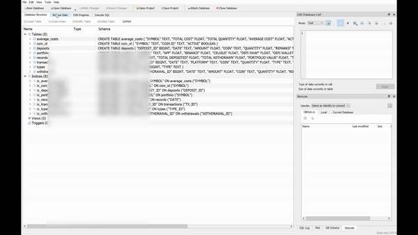
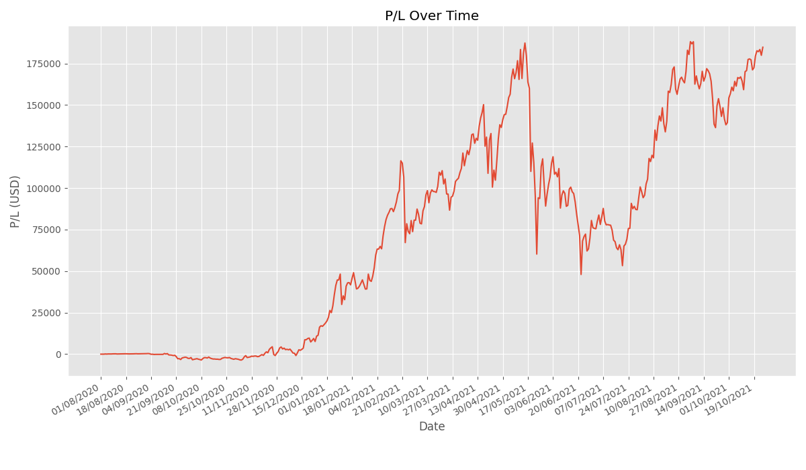
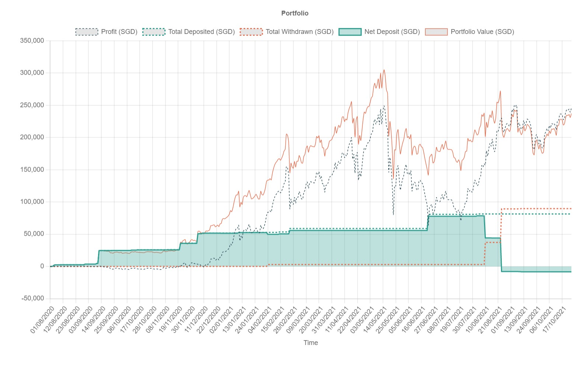

# My personal finance portfolio tracker

### Demo Images:

👨‍💻 Command Line Interface:

 

🗄️ Database Gif

 

📈 Python Graph:

 

📈 Web Graph

 

# Technologies used:

- Python
  - Process csv **uploads**
  - Process transactions
  - Selenium bot to update CoinGecko portfolio
  - Store data in sqlite database
- Javascript
  - Display web graph

# Functions:

- Add transactions
- Automatically updates CoinGecko online portfolio
- Calculate average purchase price of coins
- Calculate profit per coin
- Calculate portfolio change over time
- Display a graph of my portfolio value over time
- Display graph in web browser
- Read and save data into an sqlite database
- Upload csv file as transaction data

# File directory:

- /Crypto
  - /app_transaction
    - crypto_transactions_record_20210516_105258.csv
  - /Record
    - 2021-05
    - 2021-04
    - 2021-03
  - .env
  - chromedriver.exe
  - crypto.db
  - main.py
  - README.md
